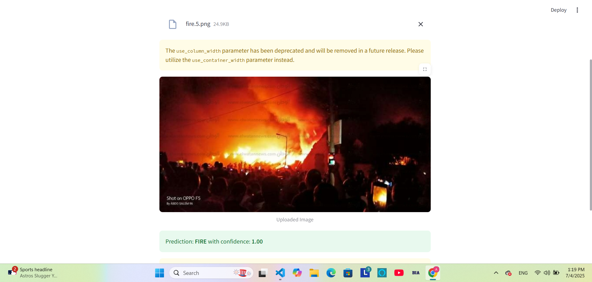
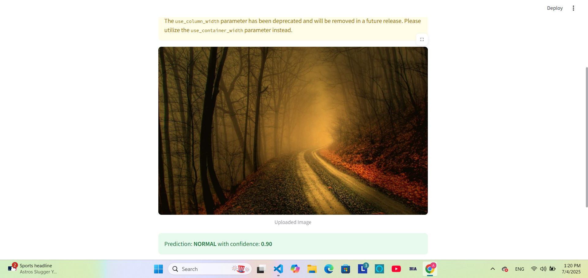
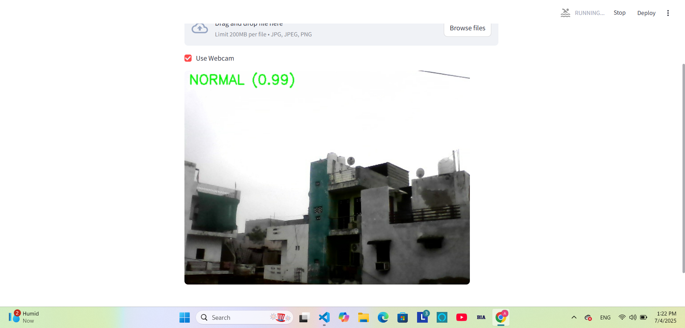

## Fire detection web app
This is a Streamlit-powered web application that detects fire in images or webcam streams using a custom-trained Convolutional Neural Network (CNN) model built with PyTorch. The app helps in identifying fire hazards from visual input with high accuracy and real-time feedback.

## Features

Predict fire vs. normal scenes from:
- Uploaded images
- Real-time webcam feed
- CNN-based image classification using PyTorch
- Intuitive Streamlit UI
- OpenCV integration for frame capture and display
- Real-time predictions with visual alerts
 ## Input Scores
- Upload .jpg, .jpeg, or .png image files.
- Use your system's webcam (via Streamlit).
- Each frame is passed through the trained CNN for prediction.

## Tech Stack
-Python 🐍
-PyTorch ⚡
-OpenCV 🎥
-Streamlit 🌐
-Torchvision & PIL for transforms
-Scikit-learn (for train-test split)
## 📷 Screenshots

### 🔥 Fire Detected from Uploaded Image

### 🌲 Normal Scene Detected from Uploaded Image

### 📹 Real-Time Webcam Detection

## Model Treaining
The model is trained using a custom CNN architecture on a public Fire vs. Normal image dataset from Kaggle.

## Dataset used:
🔥 Fire Dataset on Kaggle

## Classes:
- Fire
- Normal
- Images are resized to 224x224 and normalized before training. The model is saved as fire_cnn.pth.
## CNN Model Architecture
-Conv2D (3 → 16) + ReLU → MaxPool
-Conv2D (16 → 32) + ReLU → MaxPool
-Conv2D (32 → 64) + ReLU → MaxPool
-Flatten → FC(64×28×28 → 128) → ReLU → FC(128 → 2)
- Optimizer: Adam
- Loss Function: CrossEntropyLoss
- Epochs: 10
- Accuracy achieved: ~92% (Validation)
